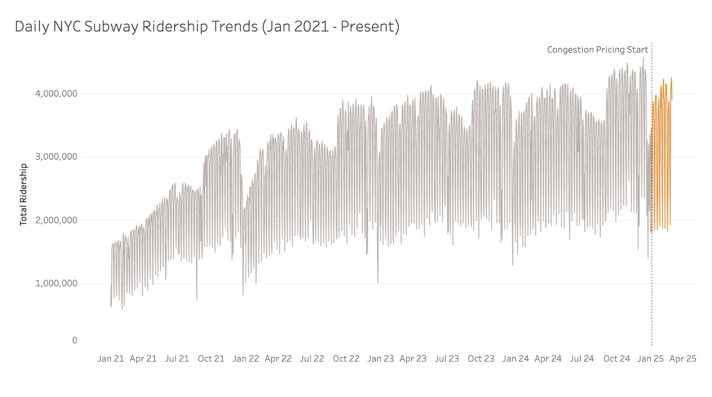
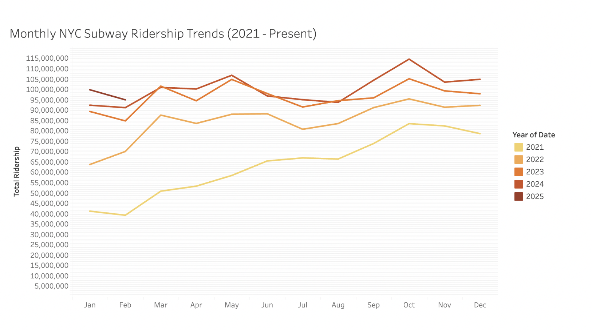
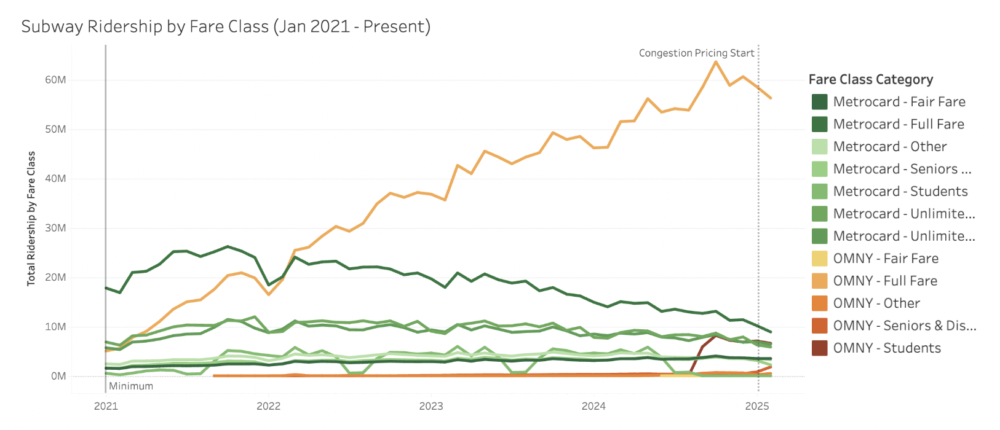
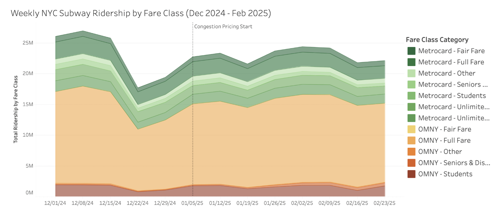
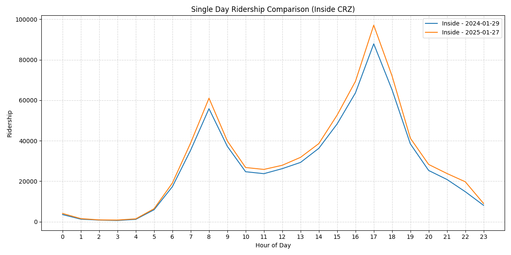
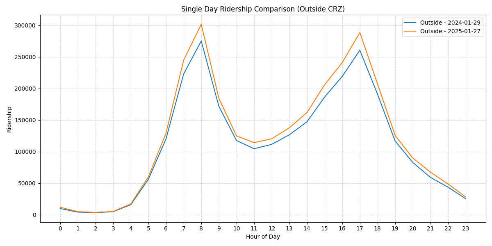
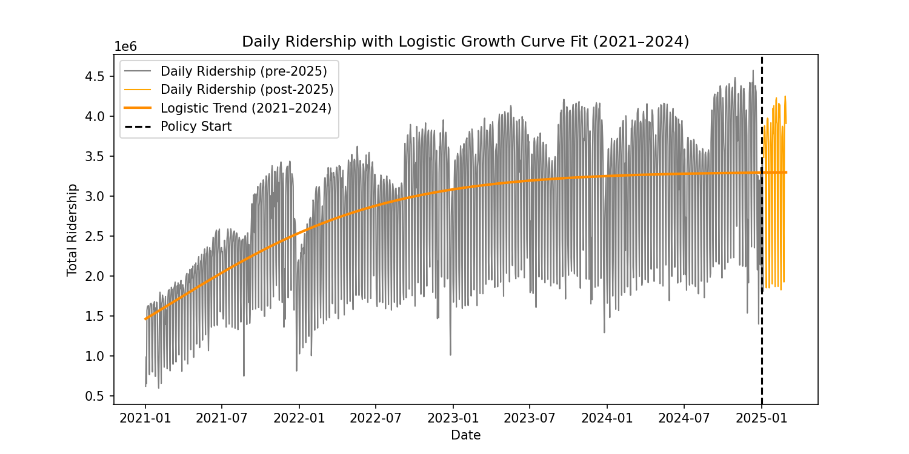
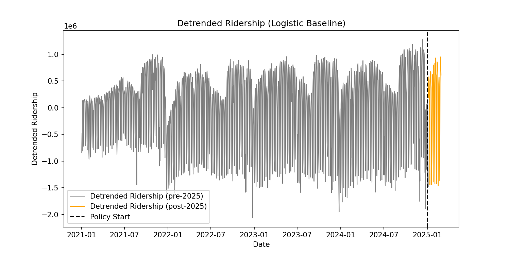
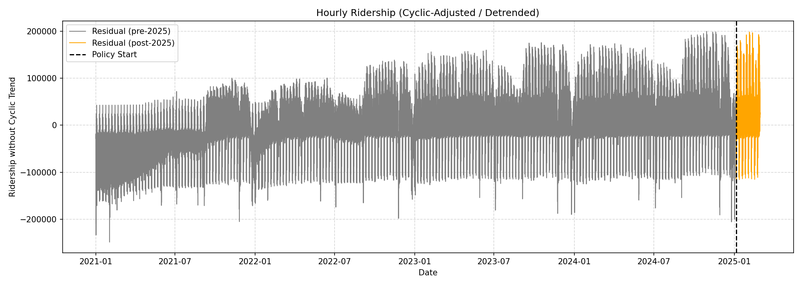

# NYC Congestion Pricing: How It Reshaped Subway Ridership

This project analyzes **how New York City’s congestion pricing policy (implemented in early 2025) impacted subway ridership patterns**. It leverages hourly ridership data from **January 2021 to February 2025** — a period chosen to capture the post-COVID ridership recovery and isolate the effects of congestion pricing.

## Table of Contents

1. [Project Overview](#project-overview)
2. [Key Findings](#key-findings)
3. [Data Sources](#data-sources)
4. [Tech Stack &amp; Data Pipeline](#tech-stack--data-pipeline)
5. [SQL Queries](#sql-queries)
6. [Visual Explorations](#visual-explorations)
7. [Time Series Analysis &amp; Detrending](#time-series-analysis--detrending)
8. [Challenges &amp; Solutions](#challenges--solutions)
9. [Limitations &amp; Next Steps](#limitations--next-steps)

---

## Project Overview

* **Goal:** Measure the impact of the 2025 congestion pricing on NYC subway ridership.
* **Scope:** Hourly ridership data from Jan 2021–Feb 2025.
* **Rationale:**
  * Account for **post-COVID recovery** trends.
  * Compare **pre-policy** vs. **post-policy** periods.
  * Focus on **Manhattan vs. non-Manhattan** ridership.

The expectation was that congestion pricing would shift car users to the subway. In reality, the change in ridership was more nuanced, illustrating how travelers adjust both **mode choice** and **travel behavior**.

> Each month of data amounted to roughly  **2,000,000 rows** , which translated to tens of millions of records between 2021 and 2025. This significant volume demanded robust storage and efficient querying strategies to ensure timely analyses.

## Key Findings

1. **COVID-Era Recovery as a Confounding Factor**: Subway ridership had already been **steadily rebounding** from its COVID-era lows. **Detrending** revealed that much of the observed ridership gains were part of a broader recovery trend rather than a direct result of congestion pricing.
2. **Weaker-Than-Anticipated Overall Ridership Increase:** After accounting for COVID recovery patterns, the **net increase** in ridership due to congestion pricing alone appears smaller than initially expected.
3. **Weekend Ridership Decline**: Weekend trips saw a **sharper decline** than weekdays, suggesting fewer **discretionary visits** to Manhattan. This change indicates that travelers adjusted behavior beyond just switching modes.
4. **Fare Payment Trends**: The shift from MetroCard to OMNY continued, but the overall impact of congestion pricing on fare class usage was relatively small.

## Data Sources

1. **[MTA Subway Hourly Ridership (2020-2024)](https://data.ny.gov/Transportation/MTA-Subway-Hourly-Ridership-2020-2024/wujg-7c2s/about_data)**
2. **[MTA Subway Hourly Ridership (Beginning 2025)](https://data.ny.gov/en/Transportation/MTA-Subway-Hourly-Ridership-Beginning-2025/5wq4-mkjj/about_data)**

Each dataset includes **timestamped ridership counts** at 15-minute intervals, broken down by station, borough, fare payment method, and more.

## Tech Stack & Data Pipeline

<p align="center">
  
  
  
  
  
</p>

1. **Data Collection**
   * Original CSV files stored in  **Google Cloud Storage (GCS)** .
2. **Data Processing & Aggregation**
   * **Python + SQL** for data cleaning and transformation.
   * Aggregated 15-minute intervals to **daily, weekly, monthly** ridership.
   * Segmented **Manhattan vs. non-Manhattan** data for comparative insights.
3. **BigQuery**
   * Hosted large-scale data (billions of rows).
   * Created optimized **pre-aggregated tables** for faster dashboard performance.
4. **Tableau Dashboards**
   * Built interactive visuals to explore temporal and spatial ridership changes.

---

## SQL Queries

A few core queries showcase how we aggregated and compared ridership data:

#### 1. Daily Subway Ridership

```
SELECT
    date,
    SUM(ridership) AS total_ridership
FROM `nyc-subway-data.nyc_ridership`
GROUP BY date
ORDER BY date;
```

* **Purpose:** Provides a foundational view of  **daily trends** —used for time series plots and baseline analyses.

#### 2. Manhattan-Only Ridership Trends

```
SELECT
    date,
    SUM(ridership) AS total_ridership
FROM `nyc-subway-data.nyc_ridership`
WHERE borough = 'Manhattan'
GROUP BY date
ORDER BY date;
```

* **Purpose:** Isolates **Manhattan** to assess congestion pricing effects in the central zone.

#### 3. Ridership by Fare Class Category

```
SELECT
    date,
    fare_class_category,
    SUM(ridership) AS total_ridership
FROM `nyc-subway-data.nyc_ridership`
GROUP BY date, fare_class_category
ORDER BY date;
```

* **Purpose:** Tracks the transition from **MetroCard** to **OMNY** usage over time.

## Visual Explorations

Below are some of the key visualizations used to understand ridership trends. Images are located in the `../visualizations/` directory (sample names shown):

1. **Daily Ridership Trend**



* Shows overall daily traffic patterns from 2021 to 2025.
* Reveals a gradual post-COVID recovery, followed by a subtle uptick around early 2025.

2. **Monthly Ridership Trend**



* Highlights seasonal fluctuations and longer-term trends.
* Confirms no large spike immediately after congestion pricing.

3. **Ridership by Fare Class**




* Breaks down the ridership by fare class to understand the usage of MetroCard vs. OMNY.

4. **Hourly Comparisons (Inside vs. Outside Manhattan)**




* Shows minimal difference in **hourly** ridership patterns before/after policy, suggesting travelers who continued to ride the subway followed the same peak/off-peak routines.

## Time Series Analysis & Detrending

To separate **organic growth** (post-COVID recovery) from **policy-induced changes**, detrending was attempted:

1. **Logistic Trend Attempt**




* Using a logistic function to model ridership recovery did not adequately capture the **hourly**, **weekly**, and **seasonal** cycles.

2. **Custom Time Series Detrending with Cyclic Features**

   * Implemented in Python (see snippet below).
   * Extracted **hour-of-day** and **day-of-week** patterns via one-hot encoding.
   * Used a **LinearRegression** model to estimate cyclical components, then subtracted these from the original ridership to obtain **residual ridership** .

```
df['hour_of_day'] = df['hour'].dt.hour
df['day_of_week'] = df['hour'].dt.dayofweek

# One-hot encode cyclical features
df_encoded = pd.get_dummies(df, columns=['hour_of_day', 'day_of_week'], drop_first=True)

# Fit linear model to capture cyclic trends
model = LinearRegression()
model.fit(df_encoded[cyclic_features], df_encoded['total_ridership'])

# Predict and remove cyclic pattern
df['cyclic_component'] = model.predict(df_encoded[cyclic_features])
df['residual_ridership'] = df['total_ridership'] - df['cyclic_component']
```

3. **Key Result**



* This plot highlights that, **once hourly and weekly cycles are removed**, there is no dramatic jump in 2025. Instead, we see a modest uptick and then a leveling off—supporting the conclusion that overall behavior changes were **less pronounced** than expected.

---

## Challenges & Solutions

1. **Large-Scale Data Handling**

   * **Problem:** With approximately **2 million rows per month** across multiple years (2021–2025), yearly CSVs reached 3GB each —too large for local processing.
   * **Solution:** The raw CSV files were offloaded to **Google Cloud Storage (GCS)**, and **BigQuery** was used for high-performance queries and aggregations. This architecture enabled efficient exploration of both raw hourly data and aggregated summaries.
2. **Maintaining Multiple Levels of Aggregation**

   * **Problem:** Needed **daily, weekly, monthly** insights without losing the ability to zoom into **hourly** trends. Attempting to do all these queries on the massive dataset at once caused slow performance.
   * **Solution:** **Pre-aggregated tables** (daily, weekly, monthly) were created, while the raw hourly data remained intact in BigQuery. This structure allowed flexible, detailed analysis without excessive query times.
3. **Combining Ridership, Fare Class, and Geographic Data**

   * **Problem:** Joins across large tables caused performance bottlenecks.
   * **Solution:** Created a **single, optimized table** with relevant columns using  **LEFT JOINs**. Indexed by station ID, borough, and date/time.

## Limitations & Next Steps

1. **Limited to Subway Data**
   * Car traffic volumes, bus ridership, or commuter rail data were not integrated. A complete citywide picture would require cross-referencing these sources.
2. **No Direct Cost Analysis**
   * We did not model how the **exact pricing rates** influenced individual travel decisions.
3. **Seasonal & Economic Factors**
   * The recovery from COVID is entangled with changes in remote work and tourism, complicating the isolation of congestion pricing effects.

**Future Enhancements**

* **Predictive Modeling**: Build time series models (ARIMA, Prophet) to forecast future ridership under different congestion pricing scenarios.
* **Integrate Traffic Data**: Compare ridership shifts with actual **vehicular congestion** metrics.
* **Station-Level Deep Dive**: Identify which stations saw the largest net gains or losses.
